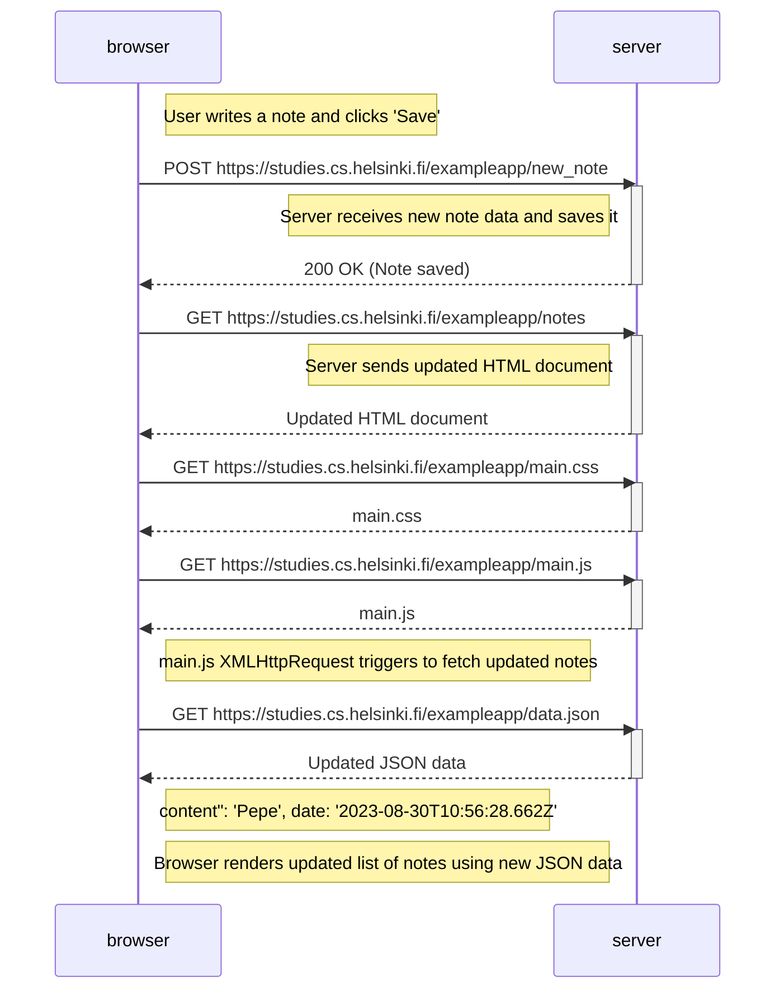

```mermaid
sequenceDiagram
    participant browser
    participant server

    Note right of browser: User writes a note and clicks 'Save'
    browser->>server: POST https://studies.cs.helsinki.fi/exampleapp/new_note
    activate server
    Note left of server: Server receives new note data and saves it
    server-->>browser: 200 OK (Note saved)
    deactivate server

    browser->>server: GET https://studies.cs.helsinki.fi/exampleapp/notes
    activate server
    Note left of server: Server sends updated HTML document
    server-->>browser: Updated HTML document
    deactivate server

    browser->>server: GET https://studies.cs.helsinki.fi/exampleapp/main.css
    activate server
    server-->>browser: main.css
    deactivate server

    browser->>server: GET https://studies.cs.helsinki.fi/exampleapp/main.js
    activate server
    server-->>browser: main.js
    deactivate server

    Note right of browser: main.js XMLHttpRequest triggers to fetch updated notes

    browser->>server: GET https://studies.cs.helsinki.fi/exampleapp/data.json
    activate server
    server-->>browser: Updated JSON data
    deactivate server

    note right of browser: content": 'Pepe', date: '2023-08-30T10:56:28.662Z'
    Note right of browser: Browser renders updated list of notes using new JSON data
```
