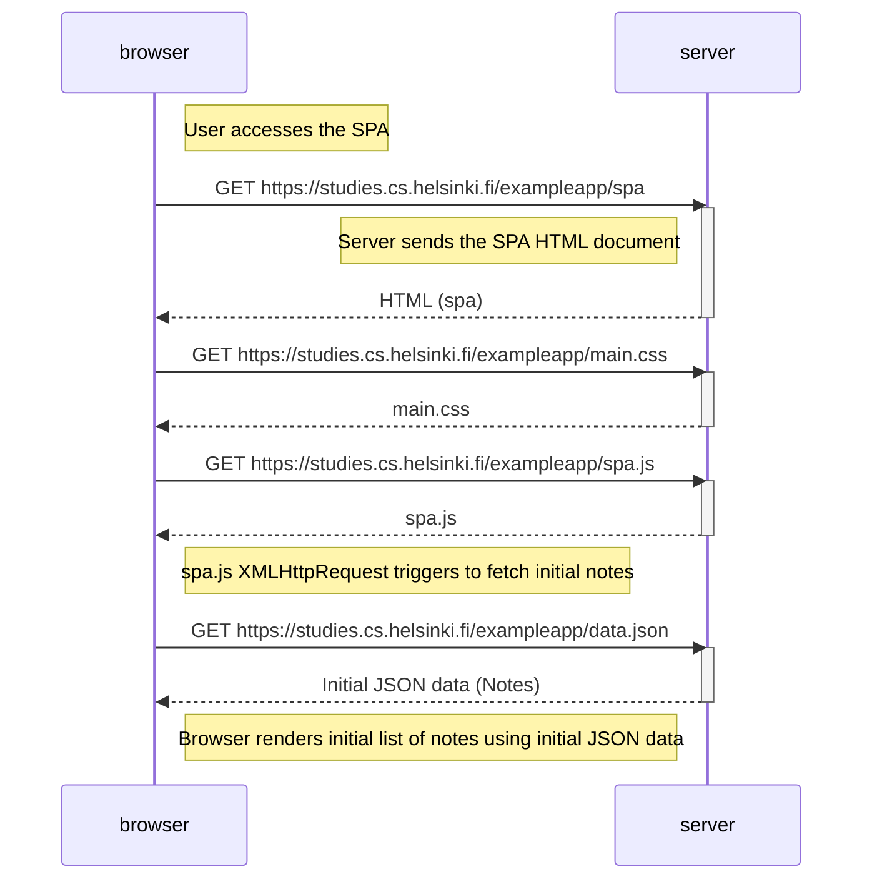

```mermaid
sequenceDiagram
    participant browser
    participant server

    Note right of browser: User accesses the SPA
    browser->>server: GET https://studies.cs.helsinki.fi/exampleapp/spa
    activate server
    Note left of server: Server sends the SPA HTML document
    server-->>browser: HTML (spa)
    deactivate server

    browser->>server: GET https://studies.cs.helsinki.fi/exampleapp/main.css
    activate server
    server-->>browser: main.css
    deactivate server

    browser->>server: GET https://studies.cs.helsinki.fi/exampleapp/spa.js
    activate server
    server-->>browser: spa.js
    deactivate server

    Note right of browser: spa.js XMLHttpRequest triggers to fetch initial notes

    browser->>server: GET https://studies.cs.helsinki.fi/exampleapp/data.json
    activate server
    server-->>browser: Initial JSON data (Notes)
    deactivate server

    Note right of browser: Browser renders initial list of notes using initial JSON data
```
