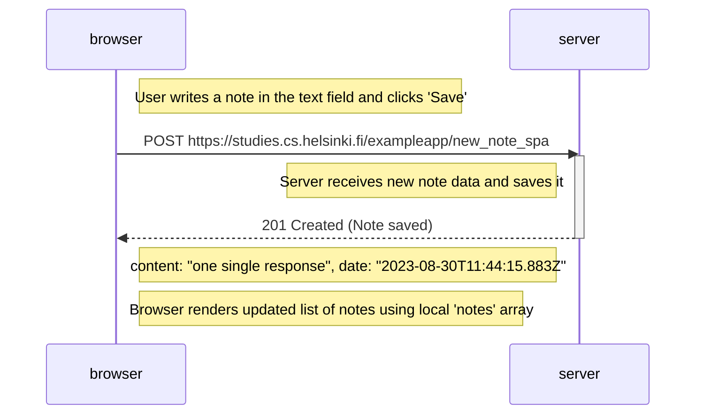

```mermaid
sequenceDiagram
    participant browser
    participant server

    Note right of browser: User writes a note in the text field and clicks 'Save'
    browser->>server: POST https://studies.cs.helsinki.fi/exampleapp/new_note_spa
    activate server
    Note left of server: Server receives new note data and saves it
    server-->>browser: 201 Created (Note saved)
    deactivate server

    Note right of browser: content: "one single response", date: "2023-08-30T11:44:15.883Z"
    Note right of browser: Browser renders updated list of notes using local 'notes' array
```
