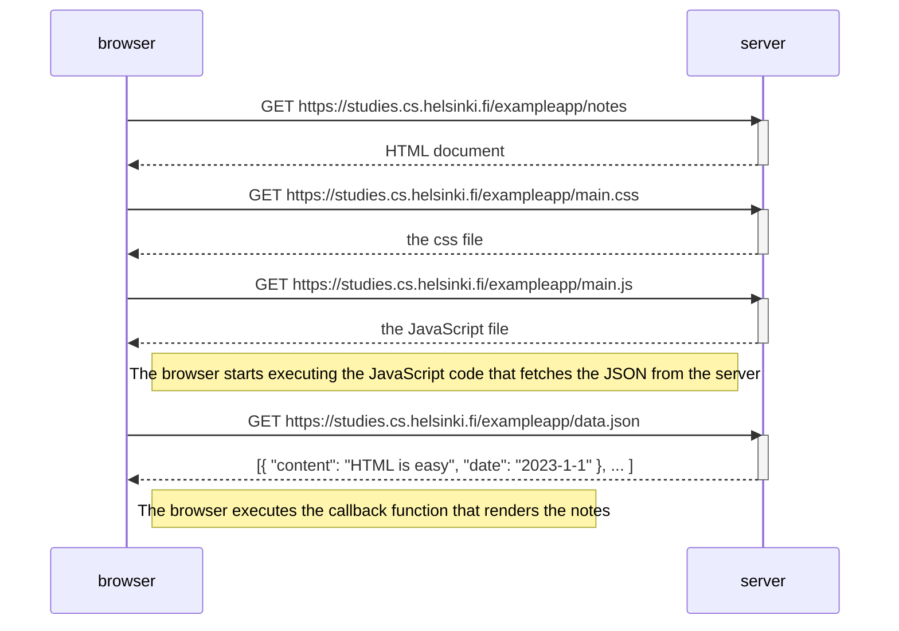

## Tehtäviä

Tehtävät palautetaan GitHubin kautta ja merkitsemällä tehdyt tehtävät [palautussovellukseen](https://studies.cs.helsinki.fi/stats/courses/fullstackopen).

Voit palauttaa kurssin kaikki tehtävät samaan repositorioon tai käyttää useita repositorioita. Jos palautat eri osien tehtäviä samaan repositorioon, käytä järkevää hakemistojen nimentää. Jos käytät yksityistä (private) repositoriota tehtävien palautukseen, liitä repositoriolle collaboratoriksi mluukkai

Eräs varsin toimiva hakemistorakenne palautusrepositoriolle on tässä esimerkki [repositoriossa](https://github.com/FullStack-HY/palauitusrepositorio) käytetty tapa, jossa kutakin osaa kohti on oma hakemistonsa, joka vielä jakautuu tehtäväsarjat (kuten osan 1 unicafe) sisältäviin hakemistoihin:

```
osa0
osa1
  kurssitiedot
  unicafe
  anekdootit
osa2
  puhelinluettelo
  maiden_tiedotcopy
```

Tehtävät palautetaan yksi osa kerrallaan. Kun olet palauttanut osan tehtävät, et voi enää palauttaa saman osan tekemättä jättämiäsi tehtäviä.

### 0.1: HTML

Kertaa HTML:n perusteet lukemalla Mozillan [tutoriaali](https://developer.mozilla.org/en-US/docs/Learn/Getting_started_with_the_web/HTML_basics) HTML:stä.

Tätä tehtävää ei palauteta GitHubiin. Riittää, että luet tutoriaalin.

### 0.2: CSS

Kertaa CSS:n perusteet lukemalla Mozillan [tutoriaali(https://developer.mozilla.org/en-US/docs/Learn/Getting_started_with_the_web/CSS_basics)] CSS:stä.

Tätä tehtävää ei palauteta GitHubiin. Riittää, että luet tutoriaalin.

### 0.3: HTML:n lomakkeet

Tutustu HTML:n lomakkeiden perusteisiin lukemalla Mozillan [tutoriaali](https://developer.mozilla.org/en-US/docs/Learn/HTML/Forms/Your_first_HTML_form) Your first form.

Tätä tehtävää ei palauteta GitHubiin. Riittää, että luet tutoriaalin.

### 0.4: uusi muistiinpano

Luvussa JavaScriptia sisältävän sivun [lataaminen](https://fullstackopen.com/osa0/web_sovelluksen_toimintaperiaatteita#java-scriptia-sisaltavan-sivun-lataaminen-kertaus) - kertaus kuvataan [sekvenssikaavion](https://www.geeksforgeeks.org/unified-modeling-language-uml-sequence-diagrams/)) avulla sivun https://studies.cs.helsinki.fi/exampleapp/notes avaamisen aikaansaama tapahtumasarja.

Kaavio on luotu GitHubiin Markdown-tiedostona hyödyntäen [Mermaid](https://docs.github.com/en/get-started/writing-on-github/working-with-advanced-formatting/creating-diagrams)-syntaksia seuraavasti:



Tee vastaavanlainen kaavio, joka kuvaa, mitä tapahtuu tilanteessa, jossa käyttäjä luo uuden muistiinpanon ollessaan sivulla https://studies.cs.helsinki.fi/exampleapp/notes eli kirjoittaa tekstikenttään jotain ja painaa nappia tallenna.

Kirjoita tarvittaessa palvelimella tai selaimessa tapahtuvat operaatiot sopivina kommentteina kaavion sekaan.

Kaavion ei ole pakko olla sekvenssikaavio. Mikä tahansa järkevä kuvaustapa käy.

Voit tehdä kaaviot, millä ohjelmistolla haluat, mutta suositeltava tapa on tehdä ne suoraan GitHubiin Markdown- eli md-päätteisiksi tiedostoiksi käyttäen Mermaid-syntaksia.

Kaikki oleellinen tieto tämän ja seuraavien kahden tehtävän tekemiseen on tässä osassa. Näiden tehtävien ideana on, että luet tekstin vielä kerran ja mietit tarkkaan, mitä missäkin tapahtuu. Ohjelman koodin lukemista ei näissä tehtävissä edellytetä, vaikka sekin on toki mahdollista.

### 0.5: Single Page App

Tee kaavio tilanteesta, jossa käyttäjä menee selaimella osoitteeseen https://studies.cs.helsinki.fi/exampleapp/spa eli muistiinpanojen Single Page App-versioon

### 0.6: Uusi muistiinpano

Tee kaavio tilanteesta, jossa käyttäjä luo uuden muistiinpanon single page ‑versiossa.

---

**Tämä oli osan viimeinen tehtävä, ja on aika pushata vastaukset GitHubiin sekä merkata tehdyt tehtävät palautussovellukseen.**
